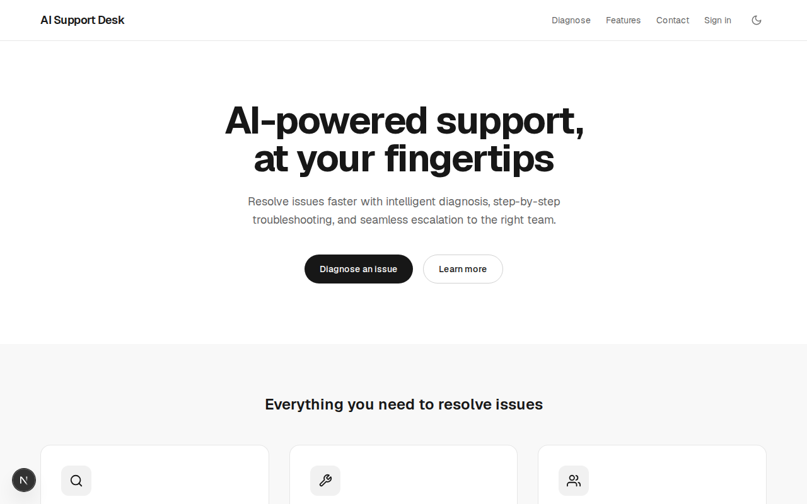
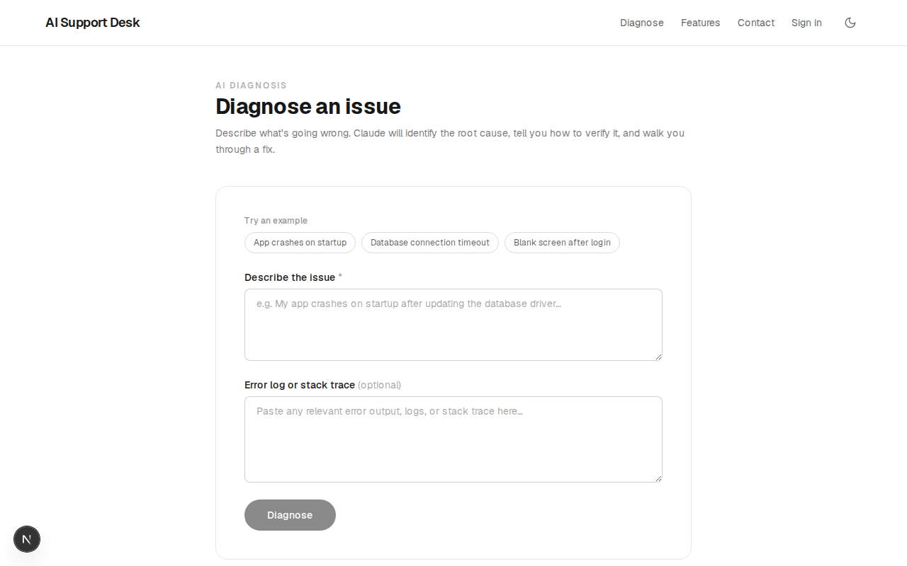
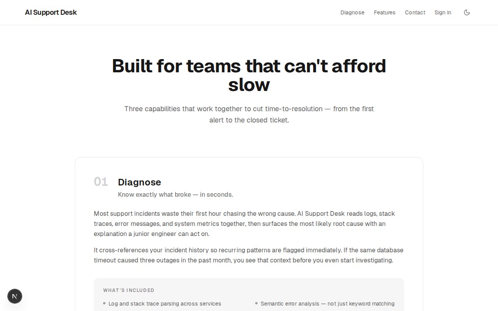
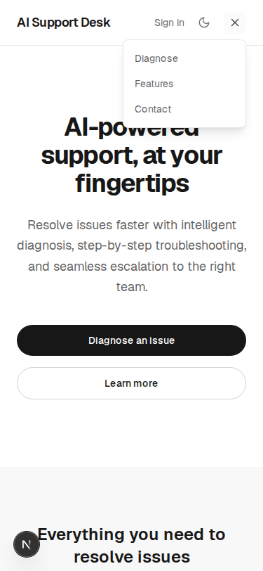

# AI Support Desk

An AI-powered technical support platform built on Next.js 16 (App Router). A visitor describes an issue and gets back a streamed, structured diagnosis — root cause, verification steps, and a fix — from Claude Opus. There's also a real contact form and a small admin dashboard for reviewing submissions.

This isn't a demo shell: the contact form actually sends email and persists to a database, both write paths are rate-limited, and there's a real (if small) test suite around the validation logic.

## Screenshots

| Home | Diagnose |
|---|---|
|  |  |

| Features | Mobile navigation |
|---|---|
|  |  |

## Features

- **AI Diagnosis** (`/diagnose`) — streams a structured root-cause analysis from Claude Opus via the Anthropic SDK, rate-limited to 10 requests/hour per IP; includes preset example issues so the flow is easy to try without typing
- **Contact Form** (`/contact`) — validated server action, honeypot spam guard, 3 submissions/hour per IP, delivers email via Resend and persists to Supabase
- **Admin Dashboard** (`/admin`) — Clerk-gated, further restricted to the email in `ADMIN_EMAIL`; shows submission stats and a table of contact entries
- **Dark / light mode** — system-aware theme, no flash on load
- **Responsive header** — desktop nav collapses into a hamburger menu below the `sm` breakpoint
- **Security headers** — `X-Frame-Options`, `X-Content-Type-Options`, `Referrer-Policy`, `Permissions-Policy` set globally in `next.config.ts`
- **Custom 404** and an edge-rendered Open Graph image
- **19 passing Vitest tests** covering contact and diagnose input validation

## Tech Stack

| Layer | Technology |
|---|---|
| Framework | Next.js 16.2 (App Router, Turbopack) |
| AI | Claude Opus via `@anthropic-ai/sdk` |
| Auth | Clerk (`proxy.ts` middleware protects `/admin`) |
| Database | Supabase (`contact_submissions` table) |
| Email | Resend |
| Rate limiting | Upstash Redis (sliding window) |
| Styling | Tailwind CSS v4 |
| Testing | Vitest |
| Deployment | Vercel |

## Architecture notes

- **Validation is pure and shared.** `lib/validate-contact.ts` has no framework dependencies, which is what makes it directly unit-testable (`tests/contact-validation.test.ts`) instead of needing a rendered form or a mocked server action.
- **Rate limiting is centralized** in `lib/rate-limit.ts` — one Upstash Redis client, two `Ratelimit` instances (`contact`: 3/hr, `diagnose`: 10/hr) keyed by IP, so both write paths share the same Redis connection instead of each route rolling its own.
- **`/api/diagnose` streams the response** back to the client as `text/plain` with `X-Accel-Buffering: no`, piping tokens from the Anthropic stream straight into a `ReadableStream` rather than buffering the full completion.
- **Admin auth is two-layered:** `proxy.ts` (Clerk middleware) blocks unauthenticated requests to `/admin(.*)`, and `app/admin/page.tsx` additionally checks the signed-in user's email against the `ADMIN_EMAIL` env var, failing closed (redirecting) if that var isn't set. It's still a single email rather than a roles table, which is fine for one admin but the first thing to replace if you add a second.
- **`/admin` is gated to local development only.** `proxy.ts` returns a plain 404 for `/admin` whenever `process.env.VERCEL` is set, before ever calling Clerk. This exists because Clerk's development-instance keys break `auth.protect()` off `localhost`, and getting production keys requires a custom domain, which this deployment doesn't have. Remove that check once you have one.
- **The header's auth-aware UI is client-only, on purpose.** `app/components/auth-controls.tsx` uses the `useAuth()` hook instead of Clerk's `<Show>` server component. `<Show>` calls `auth()` (a request-time API) during render; since it lived in the root layout, it silently forced *every* route sharing that layout into fully dynamic, uncacheable rendering — including the homepage. Swapping to a client hook (with a placeholder shown until Clerk loads, same pattern as `theme-toggle.tsx`) restored static generation for `/`, `/features`, `/contact`, and `/diagnose`, verified via `next build`'s route table.
- **The header collapses to a hamburger menu below the `sm` breakpoint** (`app/components/mobile-nav.tsx`), rather than shrinking text or wrapping — found this was necessary via screenshot testing at 375px, where the unmodified desktop nav visually collided with the logo.
- **`app/opengraph-image.tsx`** generates the OG image at request time on the edge runtime rather than shipping a static asset.

## Local Setup

### Prerequisites

- Node.js 20+
- A Clerk account and application
- A Supabase project with a `contact_submissions` table
- A Resend account (and a verified sending domain for production use)
- An Upstash Redis database
- An Anthropic API key

### 1. Clone and install

```bash
git clone https://github.com/YOUR_USERNAME/ai-support-desk.git
cd ai-support-desk
npm install
```

### 2. Environment variables

Create `.env.local` in the project root:

```env
# Clerk
NEXT_PUBLIC_CLERK_PUBLISHABLE_KEY=pk_...
CLERK_SECRET_KEY=sk_...

# Supabase
SUPABASE_URL=https://your-project.supabase.co
SUPABASE_ANON_KEY=eyJ...

# Resend
RESEND_API_KEY=re_...
CONTACT_TO_EMAIL=you@example.com

# Admin dashboard access — must match the email on your Clerk account
ADMIN_EMAIL=you@example.com

# Upstash Redis
UPSTASH_REDIS_REST_URL=https://your-db.upstash.io
UPSTASH_REDIS_REST_TOKEN=...

# Anthropic
CLAUDE_API_KEY=sk-ant-...
```

`.env.local` is gitignored — never commit real keys.

### 3. Supabase table

Run this in the Supabase SQL editor:

```sql
create table contact_submissions (
  id uuid primary key default gen_random_uuid(),
  name text not null,
  email text not null,
  message text not null,
  created_at timestamptz default now()
);
```

The app uses the anon key with no RLS policy assumptions baked in — if you enable Row Level Security on this table, add a policy that allows inserts from the anon role, or the contact form will silently fail to persist (it still validates and emails either way, since the Supabase call isn't in the critical path).

### 4. Admin access

Set `ADMIN_EMAIL` in `.env.local` to the email on your Clerk account. `/admin` redirects to `/` for anyone else, and also redirects everyone if the var is unset.

### 5. Run

```bash
npm run dev
```

Open [http://localhost:3000](http://localhost:3000).

## Scripts

```bash
npm run dev        # Start dev server (Turbopack)
npm run build      # Production build
npm run start      # Start production server
npm test           # Run Vitest test suite once
npm run test:watch # Run tests in watch mode
npm run lint       # ESLint
```

## Project Structure

```
app/
  api/diagnose/route.ts   # Streaming Claude API route, rate-limited
  admin/page.tsx          # Clerk-protected admin dashboard + stats
  contact/
    actions.ts            # Server action: honeypot, rate limit, validate, email, persist
    contact-form.tsx       # Client form using useActionState
    page.tsx
  diagnose/
    diagnose-form.tsx      # Streaming chat-style UI, preset examples, error/loading states
    page.tsx
  components/
    header.tsx             # Desktop nav; hands off to mobile-nav.tsx below sm
    mobile-nav.tsx          # Hamburger menu for small viewports
    auth-controls.tsx       # Client-side sign-in/user button (keeps pages static)
    footer.tsx, button.tsx, theme-toggle.tsx
  not-found.tsx             # Custom 404
  opengraph-image.tsx       # Edge-rendered OG image
  robots.ts                 # robots.txt — disallows /admin and /api/
  sitemap.ts                # sitemap.xml — /, /features, /contact, /diagnose
lib/
  supabase.ts              # Supabase client (server-only)
  rate-limit.ts            # Upstash Ratelimit instances (contact, diagnose)
  site-url.ts              # Shared base-URL resolution (env var → VERCEL_URL → localhost)
  validate-contact.ts       # Pure, framework-free validation — the tested surface
tests/
  contact-validation.test.ts
  diagnose-validation.test.ts
proxy.ts                    # Next.js 16 middleware — Clerk auth on /admin
next.config.ts               # Security headers
```

## Known limitations

- Admin authorization is a single email (`ADMIN_EMAIL`), not a roles table — fine for a solo project, not for a team.
- `/admin` only works when running locally (`npm run dev`/`npm start`), not on the deployed Vercel app. Clerk's development-instance keys break `auth.protect()` off `localhost`, and getting production keys requires a custom domain we don't have yet (see `proxy.ts`).
- No application monitoring or error tracking beyond `console.error` in the contact action.

## License

MIT
